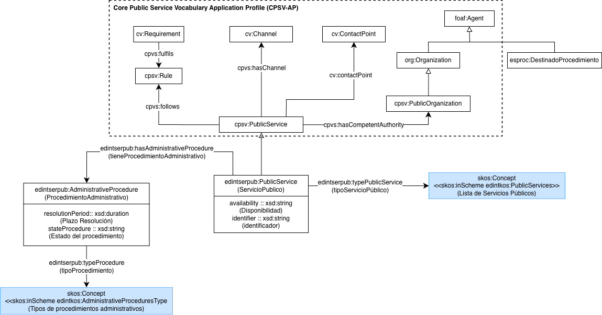

# Ontología de Servicios Públicos

La **Ontología de Servicios Públicos** representa el dominio de los servicios públicos municipales ofrecidos a la ciudadanía, incluyendo los procedimientos administrativos asociados, las organizaciones públicas responsables, los canales de prestación, los puntos de contacto, las reglas aplicables y la clasificación de los servicios mediante vocabularios controlados.

La ontología reutiliza como referencia el patrón de modelado propuesto por el **Core Public Service Vocabulary Application Profile (CPSV-AP)** , especialmente para representar conceptos centrales como `PublicService`, `Rule`, `Channel`, `ContactPoint` y `PublicOrganisation`, así como relaciones como `follows`, `hasChannel` o `isClassifiedBy`. Sobre esta base, la ontología especializa y adapta el modelo al contexto de los servicios públicos municipales, incorporando elementos propios como los procedimientos administrativos asociados, el estado del procedimiento, el periodo de resolución y esquemas de clasificación específicos para tipos de servicios y procedimientos.

# Propósito y alcance de la ontología

El propósito de la Ontología de Servicios Públicos es proporcionar un modelo semántico común para describir, organizar e interoperar información sobre servicios públicos ofrecidos por administraciones públicas. La ontología permite identificar cada servicio, clasificarlo según su tipo, relacionarlo con los procedimientos administrativos necesarios para su gestión, indicar su estado y periodo de resolución, y vincularlo con la autoridad competente, los puntos de contacto, los canales de acceso y las reglas que lo regulan.

El alcance de la Ontología de Servicios Públicos está limitado a la descripción conceptual de servicios públicos municipales y sus elementos administrativos principales. Incluye servicios públicos, procedimientos administrativos, tipos de servicios, tipos de procedimientos, organizaciones públicas competentes, puntos de contacto, canales de acceso, reglas aplicables, disponibilidad, identificadores y periodos de resolución.

# Prefijo y espacio de nombres de la ontología

El prefijo de la ontología es: **edintserpub** y se encuentra publicada en el espacio de nombres: **[http://vocab.linkeddata.es/datosabiertos/def/sector-publico/servicios-publicos#](http://vocab.linkeddata.es/datosabiertos/def/sector-publico/servicios-publicos#)**

# Modelo conceptual de la ontología

# Estructura del repositorio

El repositorio debe contener (al menos) las siguientes carpetas

| Carpeta                  | Descripción                                                                                                                                                                   |
| ------------------------ | ------------------------------------------------------------------------------------------------------------------------------------------------------------------------------ |
| **diagrams/**      | Contiene diagramas y otros recursos que representan el modelo conceptual de la ontología (por ejemplo, jerarquías de clases, relaciones).                                    |
| **documentation/** | Contiene la documentación de la ontología y artefactos relacionados en formato HTML o dirigida a usuarios.                                                                   |
| **tests/**         | Contiene las pruebas para la evaluación de la ontología.                                                                                                                     |
| **kos/**           | Contiene la implementación de vocabularios controlados o KOS, generalmente implementaciones SKOS en RDF.                                                                      |
| **ontology/**      | Contiene los archivos de implementación de la ontología en formatos como .owl, .rdf, .ttl o .jsonld                                                                          |
| **requirements/**  | Contiene todos los documentos utilizados para definir los requisitos de la ontología: ejemplos de datos, preguntas de competencia, requisitos funcionales, casos de uso, etc. |
| **shapes/**        | Contiene las restricciones SHACL utilizad para validar datos respecto a la ontología.                                                                                         |

# Mantenimiento y evolución (Maintenance and evolution)

Para manejar las incidencias o mejoras sugeridas con respecto a la ontología, recomendamos seguir las guías proporcionadas en ([Issues Management](./ISSUES.md)) para generar una incidencia.

# Financiación (Funding)

Esta ontología ha sido desarrollada en el contexto del Espacio de Datos para las Infraestructuras Urbanas Inteligentes ([EDINT](https://edint.es)).

